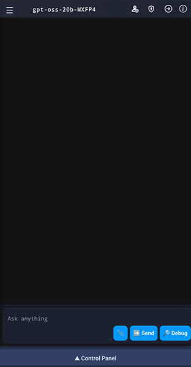
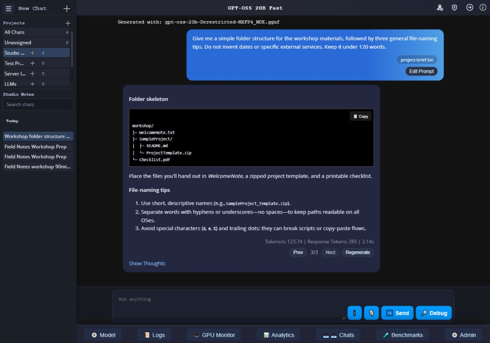
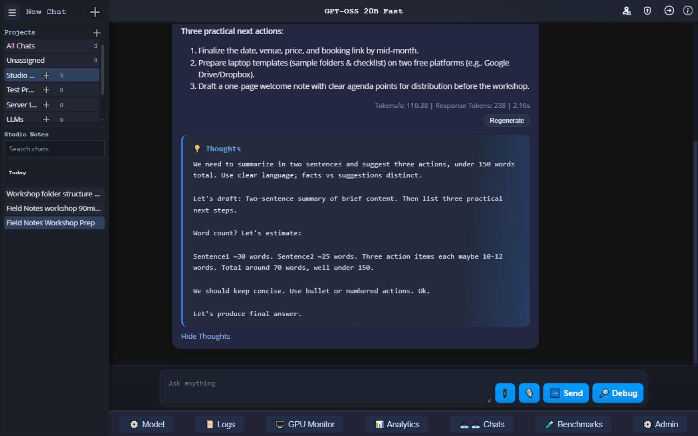
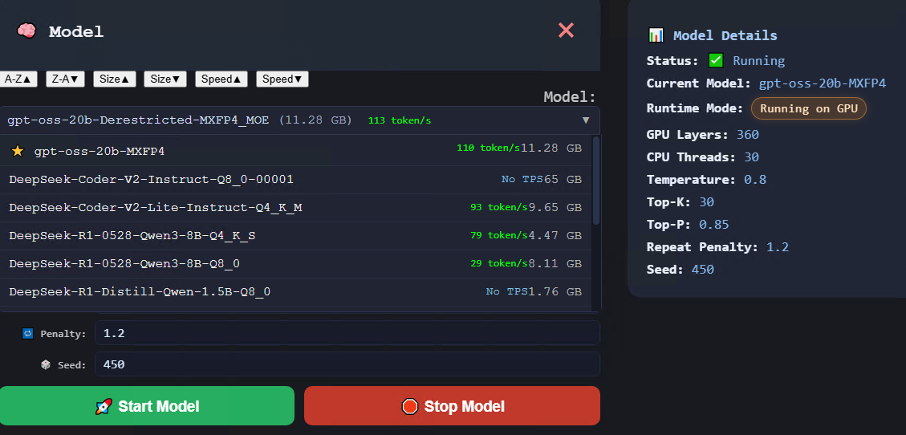
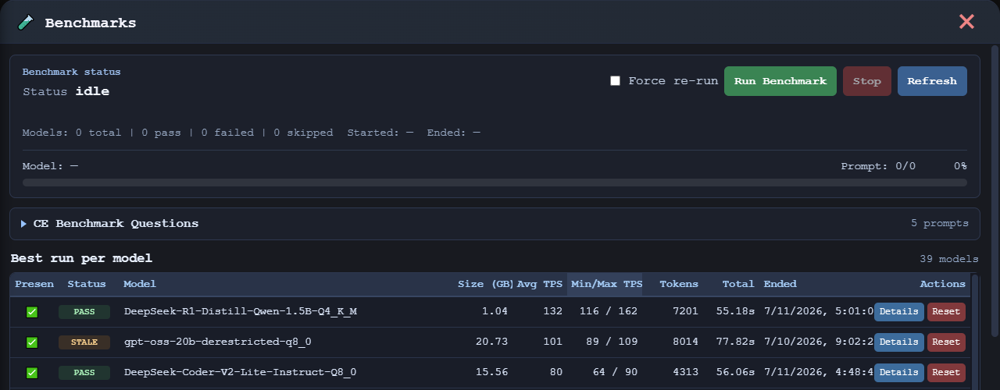
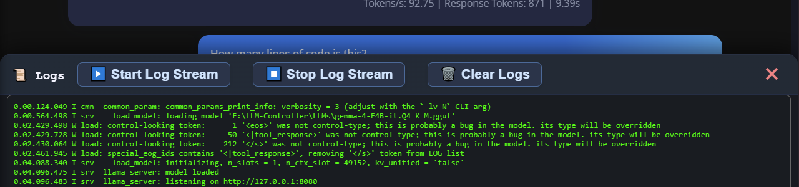
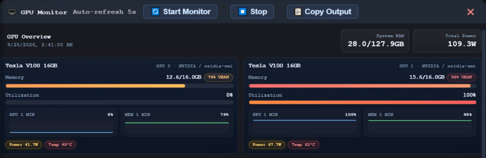
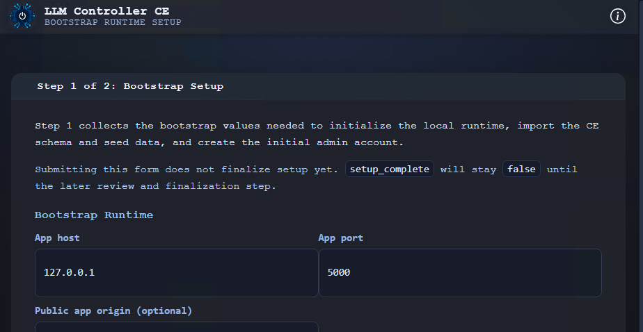

<table style="border: 0px;">
  <tr style="border: 0px;">
    <td style="border: 0px;">
      
 # LLM Controller CE

> **Your local-first AI control platform for running, managing, chatting with, monitoring, and benchmarking GGUF language models on your own hardware.**

LLM Controller CE brings the local LLM experience together into one polished control surface.

This is not just a launcher.  
It is not just a chat wrapper.  
It is not just a benchmark tool.

**LLM Controller CE** is the Community Edition foundation of the LLM Controller platform — built to make self-hosted AI feel like a real product.
    </td>
    <td>
      
    </td>
  </tr>
</table>

---

## 🚀 Why LLM Controller CE?

Running local models usually means juggling folders, terminals, runtime flags, scattered utilities, and half-finished interfaces.

LLM Controller CE changes that.

With one unified interface, you can:

- ⚡ **Launch and stop models**
- 💬 **Chat with them live**
- 🧠 **Watch reasoning/thoughts stream in real time**
- 📂 **Attach text and code files to conversations**
- 📊 **Benchmark and compare models**
- 🖥 **Monitor logs, GPU state, and runtime behavior**
- 🔧 **Manage settings, users, and system defaults**
- 🏠 **Keep everything on your own hardware**

---

## ✨ Highlights

### 💬 Modern Local Chat Experience
Stream responses live, stop generation, regenerate answers, edit your latest prompt, and keep conversations organized in a way that feels clean and natural.

### 🧠 Live Thoughts / Reasoning
Supported thinking models can expose their reasoning as it happens. Open the Thoughts panel mid-stream and watch the model work through the answer in real time.

### 🎛 Model Control Without the Mess
Discover local GGUF models, rescan them, mark favorites, manage enable/disable state, and launch them with the runtime controls you actually care about.

### 📎 File-Aware Conversations
Attach supported text and code files directly into chat workflows so the model has useful context without you having to manually paste everything in.

### 📈 Benchmarks That Actually Matter
Run admin-controlled benchmark tests, compare results, track best runs, and evaluate models inside the same platform you use to operate them.

### 🖥 Built-In Observability
Logs, GPU monitoring, raw SMI output, analytics, runtime visibility — the operational side of local AI is built in, not bolted on.

### NVIDIA SMI Monitor

### ⚙️ First-Run Installer
A built-in Windows installer workflow guides initial setup, bootstrap configuration, database connection, admin creation, and runtime defaults.

---

## 🔥 What Makes It Special

LLM Controller CE is designed to feel like a **real local AI control platform**, not a loose collection of scripts and utilities.

It brings together runtime control, conversations, reasoning-aware UI, observability, benchmarking, and system administration into one self-hosted experience that stays on your own hardware.

If you care about local AI, GGUF workflows, and controlling your own stack, this is what the experience should feel like.

---

## 🛠 Requirements

LLM Controller CE currently targets a **Windows-based self-hosted setup** and expects:

- Python 3
- MySQL
- A working `llama-server` runtime
- Local GGUF model files

---

## 📦 Installation

LLM Controller CE uses a first-run web installer.

Basic flow:

1. Install Python packages
2. Prepare MySQL
3. Place your `llama-server` runtime
4. Place your local models
5. Run `start_llm_controller.bat`
6. Open the installer at `http://127.0.0.1:5000/`
7. Complete setup
8. Restart the app
9. Log in and start using it

For full install notes, see **`INSTALL.md`**.

---

## 🧾 License

LLM Controller CE is source-available under the **Tensioncore Community Edition License 1.0**.

You may use, modify, and deploy it for personal use, research, internal business use, hosted workflows, and revenue-generating service operations that rely on the software.

You may not sell, white-label, sublicense, or commercially redistribute the software itself without written permission from **Tensioncore Administration Services**.

See **`LICENSE`** for full terms.

---

## 🏷 Attribution

LLM Controller CE is developed by **Tensioncore Administration Services**.

---

## 🌌 The Bigger Picture

LLM Controller CE is the start of a broader platform vision:

**run local AI cleanly, monitor it properly, evaluate it honestly, and keep control of your own infrastructure.**

That’s what this project is about.

## Related Project

- [LLM Controller Archive Viewer](https://github.com/tensioncore/llm-controller-archive-viewer)
