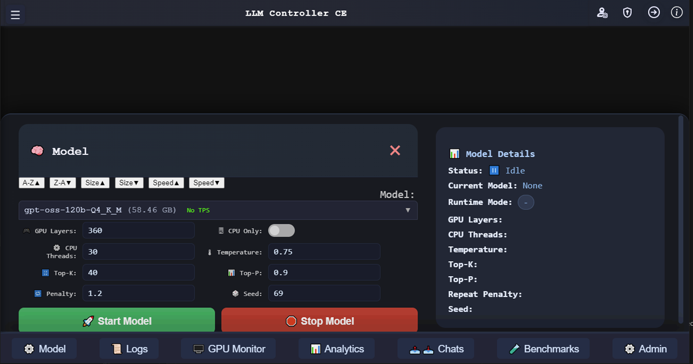

<table>
  <tr>
    <td valign="top">
      

# LLM Controller CE

> **Local GGUF chat, control, and runtime visibility through a configured `llama-server` runtime.**

LLM Controller CE is a self-hosted, local-first browser app for operating local GGUF models: chat-first interaction, admin-controlled model discovery, loading, stopping, runtime settings, live logs, GPU/runtime visibility, analytics, benchmarks, installation, and user administration.

Validated on Windows and Ubuntu when a compatible `llama-server` runtime is configured. GPU visibility supports NVIDIA and AMD telemetry where local tools and drivers are available.

This is not just a launcher.  
It is not just a chat wrapper.  
It is not just a benchmark tool.

**LLM Controller CE** is the Community Edition foundation of LLM Controller, built to make self-hosted local model operation feel like a real product.
    </td>
    <td valign="top" align="center" width="380">
      
    </td>
  </tr>
</table>

---

## Why LLM Controller CE?

Running local models often means juggling folders, terminals, runtime flags, scattered utilities, and disconnected interfaces.

LLM Controller CE changes that.

It combines the operational side and the everyday usage side of local GGUF model operation into one unified web interface, including:

- **Persistent Chat Workspace with sidebar search**
- **Reasoning-Aware Responses**
- **Managed Model Library**
- **File-Aware Conversations**
- **Controlled OpenAI-Compatible API Access**
- **Benchmarks**
- **Runtime Visibility**
- **GPU Monitor**
- **Installation & Settings**
- **Authenticated administration and user controls**
- **No cloud service required**

---

## Highlights

### Persistent Chat Workspace
Stream responses live, stop generation mid-stream, regenerate the latest answer, edit the latest prompt, and keep conversations organized through saved chat sessions with auto-generated titles, a searchable chat sidebar, and direct chat URLs that preserve the active chat across page refreshes. Save personal System Instructions for browser chats, organize conversations into Projects, and add Project Instructions for shared context within each Project.

Import JSON or CSV chat exports; administrators can also import SQLite backups with Project metadata. Export conversations as JSON, CSV, or a read-only Markdown archive.

### Reasoning-Aware Responses
When a model returns reasoning content, the interface can expose it with a dedicated show/hide workflow instead of burying it behind raw output.

### Managed Model Library
Scan a configured model directory for GGUF files, maintain a registry of available models, recognize complete split model sets, load and stop models, save runtime defaults, mark favorites, enable or disable entries, and control which models are allowed in benchmarks. Administrators can also maintain compact usage profiles and notes, review each model's recorded Max TPS, configure an optional multimodal projector, and select an enabled model for chat-title generation.

### File-Aware And Image-Aware Conversations
Attach text/code files, supported documents, and PNG, JPEG, WebP, GIF, HEIC/HEIF, AVIF, TIFF, or BMP images through the file picker, drag-and-drop, or clipboard paste. Docling converts PDF, modern Office and OpenDocument files, email, EPUB, and other supported documents locally to text. Attachments stay with saved conversations and use configurable count and size limits.

Original images are preserved. TIFF and HEIC/HEIF receive browser-compatible PNG previews; animated GIF previews remain animated. Model input uses the first frame/page, converting formats other than PNG/JPEG to PNG. Image understanding requires a compatible GGUF model, `llama-server` build, and projector. See **`INSTALL.md`** for document preparation and supported formats.

### Controlled OpenAI-Compatible API Access
Administrators can generate a single CE API key and explicitly enable an allowlisted API surface on the existing application server. It exposes only `GET /v1/models` and `POST /v1/chat/completions`, uses Bearer authentication, and serves only the active model. Streaming, non-streaming, and supported inline multimodal requests use the same private loopback `llama-server` runtime; model lifecycle and administrative routes are not exposed. Administrator-only API Analytics shows request counts, errors, duration, recorded token usage, and recent requests without storing prompts or responses.

### Benchmarks
Run administrator-controlled benchmarks across eligible models, edit the benchmark prompt set, review best-run summaries, move between summary and detailed saved outputs, and clearly distinguish current results from stale ones after prompt changes.

### Runtime Visibility
Watch live `llama-server` logs, runtime status, active process visibility, system RAM used/total, GPU telemetry where available, and per-model analytics without needing a separate dashboard.

### GPU Monitor
The GPU Monitor supports NVIDIA and AMD telemetry paths where local tools such as `nvidia-smi`, `rocm-smi`, or `rocminfo` are installed and compatible with the host environment.

### Installation & Settings
A built-in two-step installation flow initializes the application, prepares the MySQL database, creates the first administrator account, and saves runtime defaults before normal app access is opened.

---

## What Makes It Special

LLM Controller CE is designed to feel like a **real local AI control product**, not a loose collection of scripts and utilities.

It brings together runtime control, conversations, reasoning-aware UI, observability, benchmarking, and system administration into one self-hosted experience that stays on your own hardware.

For people who care about local AI and controlling their own stack, this is the experience the software should deliver.

---

## Requirements

LLM Controller CE v1.3 targets Python 3.11.7 and MySQL 8.0.22. It expects a self-hosted environment with:

- Python 3
- MySQL
- A working `llama-server` runtime compatible with the host OS and hardware
- Local GGUF model files
- For image understanding, a compatible multimodal model and projector (`mmproj`) file
- A writable install folder
- Local NVIDIA or AMD GPU telemetry tools where GPU visibility is expected

---

## Installation

LLM Controller CE uses a first-run web installer.

Basic flow:

1. Install Python packages and prepare local Docling artifacts if PDF support is needed
2. Prepare MySQL
3. Place your `llama-server` runtime
4. Place your local models
5. Start the application
6. Complete the two-step installation flow
7. Restart the app cleanly
8. Log in and begin using the app

See **`INSTALL.md`** for Linux and Windows installation guides.

---

## Access Model

LLM Controller CE is built for authenticated use, including shared environments, not just a one-off single-user shell.

Current access behavior includes:

- Email and password login
- Remember-me support
- Role-aware interface behavior
- Administrator-only management controls
- Forced password change flow for accounts created with temporary credentials

---

## License

LLM Controller CE is licensed under the **GNU General Public License version 3.0 (GPLv3)**.

See **`LICENSE`** for full terms.

---

## Attribution

LLM Controller CE is developed by **Tensioncore Administration Services**.

---

## The Bigger Picture

LLM Controller CE is the start of a broader product direction:

**run local AI cleanly, monitor it properly, evaluate it honestly, and keep control of your own infrastructure.**

That's what this project is about.

## Related Links

- [Public Site](https://www.llmcontroller.com)
- [Wiki](https://wiki.llmcontroller.com)
- [LLM Controller Archive Viewer](https://github.com/tensioncore/llm-controller-archive-viewer)
