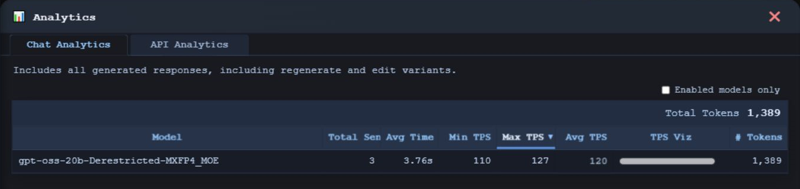

  

<h1 align="center">LLM Controller CE</h1>

<strong>Local AI. Under your control.</strong>

  Chat with local models. Work with your files. Keep your AI on your hardware. 
  One browser workspace, from the first conversation to the controls behind it.

<strong>Free and open source. No cloud AI service required.</strong>

  <a href="INSTALL.md"><strong>Get started</strong></a> ·
  <a href="docs/CHAT.md">Explore the workspace</a> ·
  <a href="docs/README.md">Documentation</a>

## A workspace for your work.

Bring your writing, code, documents, and ideas into the conversation. Keep related chats together in Projects, add instructions for the work at hand, and pick up where you left off.

Responses stream as they arrive. Edit a prompt, regenerate an answer, or explore a model's reasoning when it provides it. Your conversations stay searchable, saved, and exportable.

Attach documents for local text extraction, or ask a compatible vision model about an image. Prefer speaking? Optional local voice dictation puts your words into the composer for you to review and send.

[Explore chat, Projects, and files →](docs/CHAT.md) · [Set up local voice →](VOICE_INSTALL.md)

## Choose what runs.

Build a library from your local models. Find a favorite, load it, and stop it when you're done. Keep useful notes, configure image-capable models, and choose which models take part in benchmarks.

CE brings model management and everyday chat together—so you can spend less time moving between folders, terminals, and separate tools.

[Explore model management →](docs/MODELS.md)

## See what is happening.

Follow recorded usage and performance. Compare benchmark results. Check runtime logs, memory use, and GPU activity without leaving CE.

For your own tools and integrations, an optional OpenAI-compatible API provides controlled access to the active model. Administrators decide when it is available.

[Explore analytics and monitoring →](docs/MONITORING.md) · [Connect an application →](docs/API.md)

## Make it yours.

Self-host CE on Windows or Ubuntu/Linux with Python, MySQL, a compatible `llama-server` runtime, and local GGUF models. A first-run web installer guides application setup. The runtime and models are supplied separately; this is not a bundled one-click desktop installer.

Use it yourself or provide authenticated access to others, with administration kept behind role-aware controls. Image understanding needs a compatible model and projector. Local voice is optional and has its own setup guide.

**[Start with the installation guide →](INSTALL.md)**

---

[Documentation](docs/README.md) · [Administration](docs/ADMIN.md) · [Website](https://www.llmcontroller.com) · [Release downloads](https://github.com/tensioncore/llm-controller-ce/releases) · [Report an issue](https://github.com/tensioncore/llm-controller-ce/issues)

Developed by **Tensioncore Administration Services**. Community Edition is licensed under **[GPLv3](LICENSE)**.
